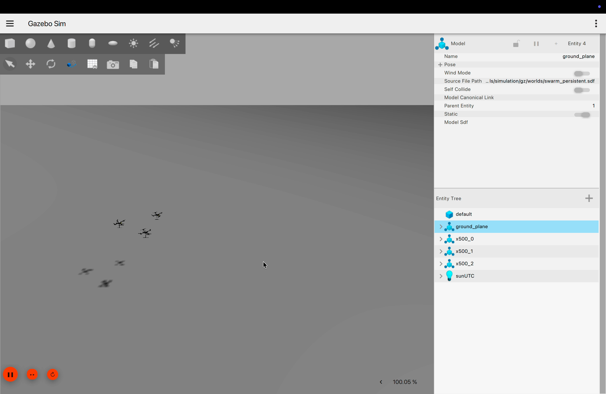
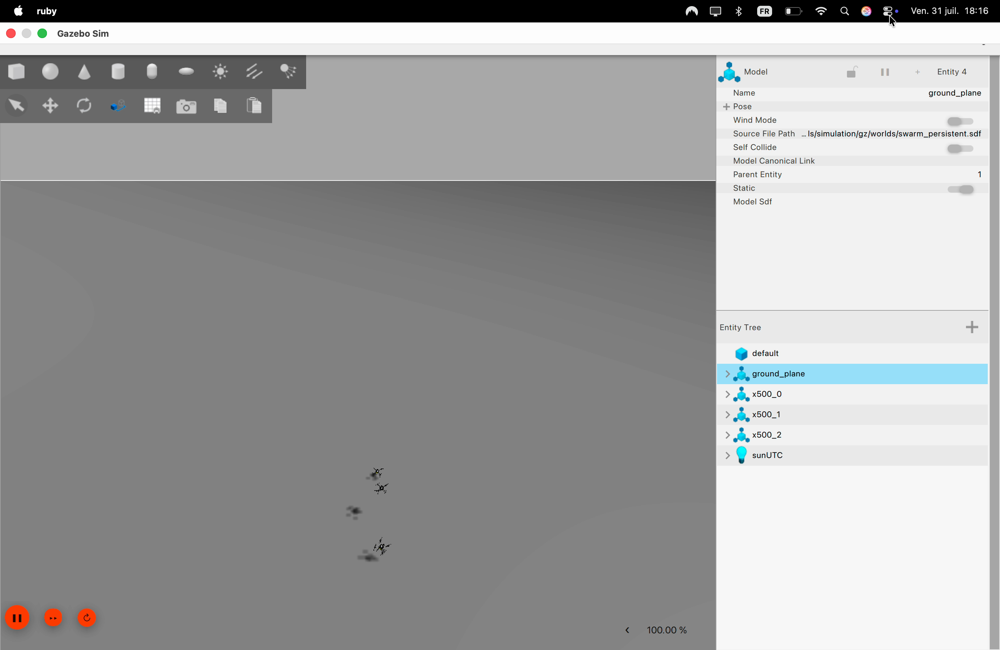

# Session Report — 2026-07-31

## What was done today

- Validated the two automated test suites end to end on the native macOS
  (RoboStack) path:
  - `test_election.py` (comm/election, no PX4 required) — 3/3 tests passing,
    confirmed stable across repeated runs.
  - `test_formation.py` (real PX4 SITL flight — takeoff, Offboard, in-flight
    leader failover) — 2/2 tests passing.
- Ran the full swarm demo repeatedly end to end: takeoff of all 3 drones,
  stable triangle formation, simulated radio disconnection of `drone_0`,
  automatic reconnection, and RTL (return-to-launch) landing.
- Captured video of the full scenario in Gazebo (top-down view), including the
  disconnect/reconnect of `drone_0` — see `demo_swarm_2026-07-31_1815.mov`
  (this session) and `demo_swarm_2026-07-31_1252.mp4` (earlier reference
  recording) in this folder.
- Wrote up the collision-avoidance control law separately in
  [`collision_avoidance.md`](./collision_avoidance.md) — constraints and
  operating principle only, exclusive of communication/election.

## Screenshots (from `demo_swarm_2026-07-31_1815.mov`)

**Stable formation, all 3 drones connected:**

**`drone_0` isolated during the simulated radio disconnection:**

**Automatic reconnection, RTL in progress:**

**All 3 drones regrouped, close to landing:**

## Known issue: takeoff is not always clean

Two separate problems showed up around takeoff during today's session, both
reproducible:

1. **Arming denied on the first attempt after a previous landing.** Relaunching
   the ROS 2 nodes right after an RTL sometimes fails to arm
   (`Arming denied: Resolve system health failures first`) — PX4's own health
   checks need a moment after landing before they'll allow a re-arm. Currently
   worked around by killing and relaunching `swarm_comm` a second time; not a
   real fix.
2. **Occasional hard landing / freefall right after takeoff or right at
   reconnection**, independent of (1). This matches the "known limitation"
   documented in `collision_avoidance.md`: real telemetry has shown roll/pitch
   of 41–56° during a fall, consistent with an actual airframe knock between
   two drones in Gazebo (all 3 spawn only ~2 m apart and converge on their
   formation slots the instant they're airborne). `MIN_ALT_HARD_M` catches it
   and lands the drone safely every time it's been observed, but the root
   cause of the physical near-miss itself is still open.

**I'll pick this up this week to find out exactly where the takeoff problem is
coming from** — likely candidates to check first: spawn spacing in
`worlds/swarm_persistent.sdf`, and whether `TAKEOFF_SPEED_CAP_M_S` /
`TAKEOFF_SPEED_RAMP_S` are actually being tight enough for the first couple of
seconds specifically (as opposed to the full 8 s window).
